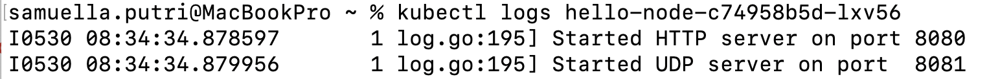
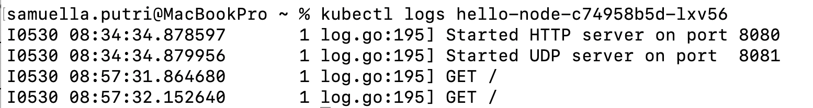
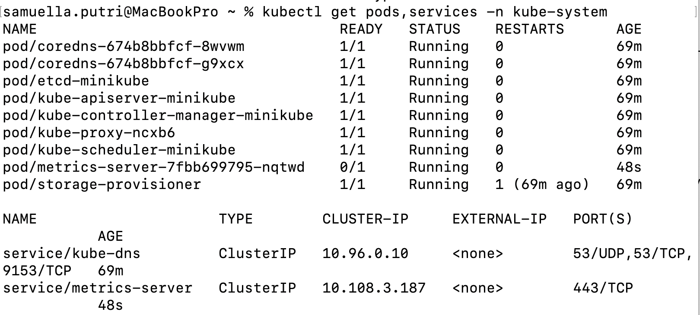

# MODULE 11 - 2306170446 - SAMUELLA PUTRI NADIA PAUNTU

## Reflection on Hello Minikube
1. 


Before exposing the application as a service, the logs only showed the server starting on ports 8080 and 8081. After exposing it, and running the proxy, new log entries began to appear when the app was accessed. Each time the app was opened in the browser, a new GET / request was logged. This indicates that traffic from the proxy is reaching the application pod. The number of GET logs increased with each access, confirming the connection works. This shows that exposing the deployment as a service correctly forwards user requests to the application.

2. 

The -n option in kubectl stands for namespace. When we use -n kube-system, it tells kubectl to only show resources from the kube-system namespace. This namespace contains system-level components like metrics-server. On the other hand, running kubectl get pods without -n shows resources in the default namespace. That's why the explicitly created pods/services didn't appear when using -n kube-system, they exist in the default namespace. Each namespace isolates resources, so we must specify the correct one to see what we're looking for.

## Reflection on Rolling Update & Kubernetes Manifest File
1. Rolling Update strategy updates pods gradually, replacing old pods one by one. This ensures the application remains available during the update process. It is commonly used in production environments to avoid downtime. In contrast, Recreate strategy first deletes all existing pods before creating the new ones. This causes downtime, but simplifies the update process. Recreate is suitable for development or non-critical systems where availability is not a concern.

2. I exported the current deployment YAML using kubectl get deployment. Then, I modified the strategy section to use 
```
   strategy:
      type: Recreate
```
 I saved the file as deployment-recreate.yaml and applied it using kubectl apply -f deployment-recreate.yaml. After applying, I observed that the old pods were terminated before new ones were created. This confirms the Recreate strategy was correctly applied. The deployment completed successfully, but there was a short downtime during the transition.

3. I created a new manifest file named deployment-recreate.yaml (for this point)

4. Manifest files provide a declarative way to define application configurations. They make deployment more consistent, repeatable, and easier to manage. With YAML files, I can track changes and roll back when needed using version control like Git. Compared to manual kubectl commands, manifests reduce the chance of human error. They also simplify collaboration and handoffs in a team environment. Overall, using manifest files is more reliable and scalable for managing Kubernetes resources.


